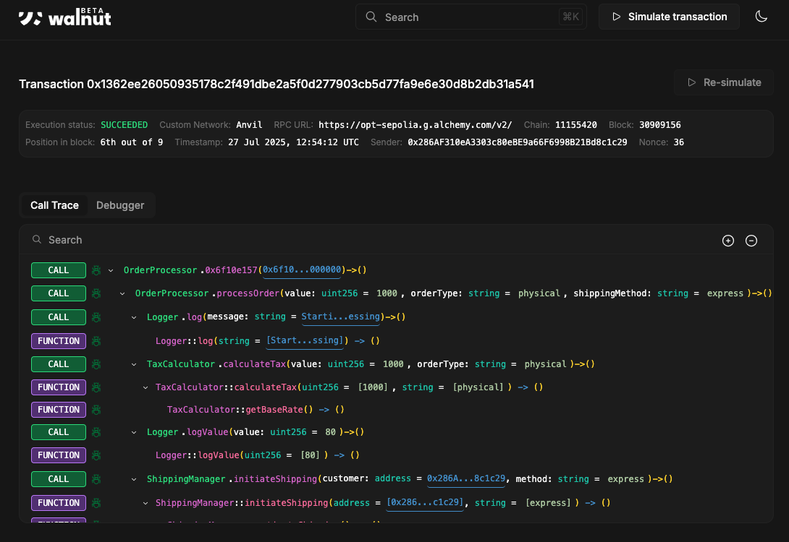

# Walnut EVM transaction debugger

Transactions traces and step-by-step debugger for any EVM-compatible chain.

## Prerequisites

This project depends on [walnut-cli](https://github.com/walnuthq/walnut-cli), you should carefully follow the installation guide of the CLI before getting started.

## Getting Started

Copy `.env.example` into `.env.local` at the root of your repository to bootstrap your configuration.

```sh
cp .env.example .env.local
```

You'll need to populate the environment variables with your own values to properly configure your EVM network:

```
NEXT_PUBLIC_RPC_URL="RPC_URL_WITH_DEBUG_ENDPOINTS_SUPPORT"
NEXT_PUBLIC_NETWORK_NAME="OP Sepolia"
NEXT_PUBLIC_CHAIN_ID="11155420"
```

Most importantly, your node RPC URL should support `debug_traceTransaction` and `debug_traceCall` endpoints which are usually not available on public nodes so make sure to provide a dedicated node RPC URL.

## Running the debugger

After your environment variables are configured, install the dependencies and build the debugger:

```sh
npm install
npm run build
```

The debugger will be available at http://localhost:3000 after being launched:

```sh
npm start
```

You can either search a particular transaction by hash on your configured network or try an example simulation by clicking on the link on the homepage.



On the transaction screen, you can click on the Re-simulate button to run a simulation with different calldata.


## Running locally in dev mode

To start the app locally and further customize the debugger, you can run:

```sh
npm run dev
```

## Contributing

Contributions are encouraged, but please open an issue before making any major changes to ensure your changes will be accepted.
