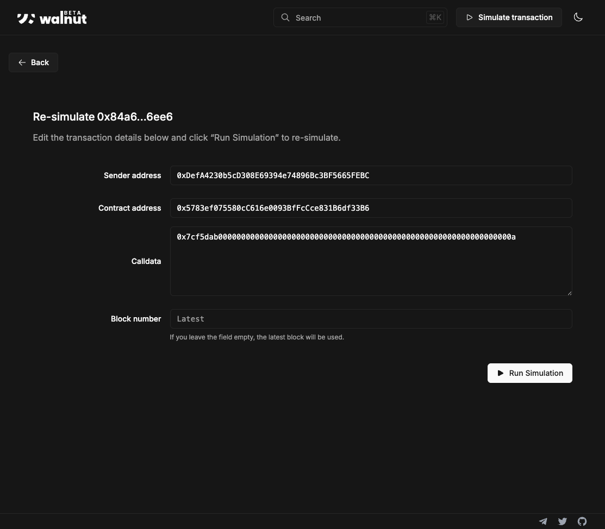

<br>


**Walnut** is a fully open-source, self-hostable transaction debugger and simulator for the Ethereum ecosystem.

- Full transaction traces, simulations, and step-by-step debugging
- Can be self-hosted and connected to any RPC—ideal for rollups and Rollup-as-a-Service platforms
- Enterprise-grade privacy: zero telemetry, full data control, and on-premises hosting

## Table of Contents

- [Who is Walnut for?](#who-is-walnut-for)
- [Live Demo](#live-demo)
- [Features and Roadmap](#features-and-roadmap)
- [Enterprise & Privacy](#enterprise--privacy)
- [Deployment and Self-Hosting](#deployment-and-self-hosting)
- [Local Setup & Usage](#local-setup--usage)
- [Contributing](#contributing)
- [Acknowledgements](#acknowledgements)
- [License](#license)
- [Security Practices](#security-practices)
- [Support & Contact](#support--contact)

## Who is Walnut for?

- **Rollups** seeking a robust transaction debugger for their own chains—simply self-host Walnut or [contact us](https://walnut.dev/contact) for assistance.
- **Rollup-as-a-Service Platforms** looking to offer advanced transaction debugging as part of their platform.
- **Smart contract developers** who want to trace, simulate, and understand on-chain code execution.
- **Enterprises** that require privacy, data protection, and self-hosting—[get in touch](https://walnut.dev/contact) for custom support or deployment help.

## Live Demo

Try Walnut live at [evm.walnut.dev](https://evm.walnut.dev)


## Features and Roadmap
- [x] Full transaction call trace with internal function calls and decoded values 
- [x] Step-by-step transaction debugger
- [x] Transaction simulations
- [x] Custom RPCs including local (Anvil, Public RPCs, custom chains)
- [ ] Gas flamechart
- [ ] State changes
- [ ] Cross-chain message tracing
- [ ] Realtime monitoring

## Enterprise & Privacy

Walnut is designed for organizations that require strict data privacy and control. All data is processed locally with zero telemetry, ensuring sensitive information never leaves your infrastructure. For privacy-sensitive or enterprise deployments, [contact us](mailto:support@walnut.dev).

## Deployment and Self-Hosting

Walnut is built for self-hosting and is designed to run within your own infrastructure, with support for advanced deployment scenarios using Docker and Kubernetes.

Docker images and deployment guides will be available soon. In the meantime, please reach out if you have specific requirements or would like to discuss custom setups.

## Local Setup & Usage

### 1. Install Prerequisites

This project depends on [walnut-cli](https://github.com/walnuthq/walnut-cli). **Follow the CLI installation guide carefully, using the [Install from source](https://github.com/walnuthq/walnut-cli#a-install-from-source-recommended) instructions.**
This will create a Python Virtual Environment within the CLI folder.

> **Note:** The Python Virtual Environment created during walnut-cli setup is also required for running Walnut as described below.

---

### 2. Set Up Environment Variables

Copy `.env.example` to `.env.local` at the root of your repository:

```sh
cp .env.example .env.local
```

Edit `.env.local` and set the following variables for your EVM network:

```
NEXT_PUBLIC_RPC_URL="RPC_URL_WITH_DEBUG_ENDPOINTS_SUPPORT"
NEXT_PUBLIC_NETWORK_NAME="OP Sepolia"
NEXT_PUBLIC_CHAIN_ID="11155420"
```

> Your node RPC URL **must** support `debug_traceTransaction` and `debug_traceCall` endpoints. These are usually not available on public nodes, so use a dedicated node RPC URL.

---

### 3. Activate Python Virtual Environment

Before running Walnut, activate the Python Virtual Environment created during walnut-cli installation.  From the root of this repository, run:

```sh
source ../walnut-cli/MyEnv/bin/activate
```

> **Note:** Replace `../walnut-cli/MyEnv/bin/activate` with your actual virtual environment path if it differs.  
> You should see your shell prompt change, indicating the environment is active. Keep this environment activated for all steps that require walnut-cli or Python dependencies.

---

### 4. Install Dependencies & Build

```sh
npm install
npm run build
```


---

### 5. Run the Debugger

Start the application:

```sh
npm start
```

The debugger will be available at [http://localhost:3000](http://localhost:3000).

You can search for a transaction by hash or try an example simulation from the homepage.


On the transaction screen, click "Re-simulate" to run a simulation with custom calldata.



## Contributing

Contributions are encouraged, but please open an issue before making any major changes to ensure your changes will be accepted.

## Acknowledgements

We would like to thank the following projects and communities for their support and inspiration:

- [4bytes](https://www.4byte.directory/) — for maintaining a comprehensive open database of Ethereum function signatures.
- [Anvil](https://github.com/foundry-rs/foundry/tree/master/anvil) — for providing a fast, flexible local Ethereum node for development and testing.
- [Arbitrum Stylus](https://github.com/OffchainLabs/stylus) — for supporting Walnut in building debugging tools for Stylus, which served as foundational code for this project.
- [ETHDebug format](https://github.com/ledgerwatch/ethdebug) — for defining an open specification for EVM debugging traces, which we leverage in Walnut’s trace handling.
- [Foundry](https://github.com/foundry-rs/foundry) — for delivering a powerful Ethereum development toolkit; parts of their code are reused in this project.
- [Optimism](https://www.optimism.io/) — for providing a grant that enables the ongoing development of this project.
- [Solidity Compiler](https://github.com/ethereum/solidity) — for developing and maintaining the Solidity language and compiler, which underpin much of the EVM ecosystem.
- [Sourcify](https://sourcify.dev/) — for offering an open source contract verification service, which is integrated into Walnut.
- [Starknet](https://starknet.io/) — for supporting Walnut’s development for Starknet; significant portions of code from the Starknet project are leveraged here.

If you believe your project should be credited here, please let us know!

## License

Walnut is licensed under the Business Source License 1.1 (BSL 1.1). See [LICENSE.md](./LICENSE.md) for details.

## Security Practices

Walnut is developed with security in mind. We follow best practices including regular dependency updates, code reviews, and static analysis. Sensitive data is never transmitted or logged externally, and all processing can be performed within your own infrastructure. We encourage responsible disclosure of any vulnerabilities—please contact us at [support@walnut.dev](mailto:support@walnut.dev) with security concerns.

## Support & Contact

For support, questions, or to get involved:

- Join our Telegram group: [@walnuthq](https://t.me/walnuthq)
- Submit an issue on GitHub: [https://github.com/walnuthq/walnut](https://github.com/walnuthq/walnut)
- Visit our website: [walnut.dev](https://walnut.dev)
- Email us: [support@walnut.dev](mailto:support@walnut.dev)
